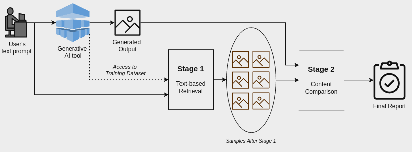

# Enhancing Interpretability in Generative AI Through Search-Based Data Influence Analysis
**Abstract:** Generative Artificial Intelligence (AI) models have emerged as powerful tools across diverse applications. Their inherent complexity often makes them opaque, which in turn complicates understanding their decision-making processes. In response to this challenge, we present a novel approach trying to enhance the interpretability of generative AI models by analysing the influence of training data on model's outputs. Our method offers observational interpretability, meaning that it allows for understanding by observing the outputs of a model. It is inspired by information retrieval methods, aimed at locating the most similar input items to the generated output.

Subsequently, we utilise a range of  similarity metrics based on both raw as well as latent-space  embeddings  using a pre-trained network.
We evaluate the effectiveness of our method by retraining local models, demonstrating its ability to uncover influential subsets within the training dataset. Furthermore, this work lays the groundwork for future extensions and analyses, including user-based evaluations with domain experts such as artists and photographers. Validating the importance of the retrieved training samples in generated specific content more accurately, will contribute to improved observational interpretability.

**Keywords:** Interpretability, Observational interpretability, Generative AI models, AI Act, Image generation, Information retrieval methods, Training data analysis, Unlearning, Similarity metrics.

Our Proposed Method can be depicted in the following figure.

# Train a generative model locally:
In order to train and use a local model for our generations we used the [Dalle-pytorch](https://github.com/lucidrains/DALLE-pytorch) package. It is an implementation of [DALL-E](https://openai.com/blog/dall-e/) ([paper](https://arxiv.org/abs/2102.12092)), OpenAI's Text to Image Transformer, in Pytorch.

# Struct of the Code

<!-- Folder structure -->
<ul>
    <li>
        &#128193; <!-- Unicode for folder icon -->
        Local_Dalle
        </li>
    <li>
        &#128193;
        Unlearning
    </li>
     <li>
        &#128193;
        DDG Experiments
    </li>
</ul>

# Results

You can Try to generate with your own fashion prompts in [Colab](https://colab.research.google.com/drive/1DzYXIfrPrri8qJmPz2WWbSLsISKf85eX)

Contact For inquiries or assistance, you can reach me at : teoaivalis@iit.demokritos.gr
