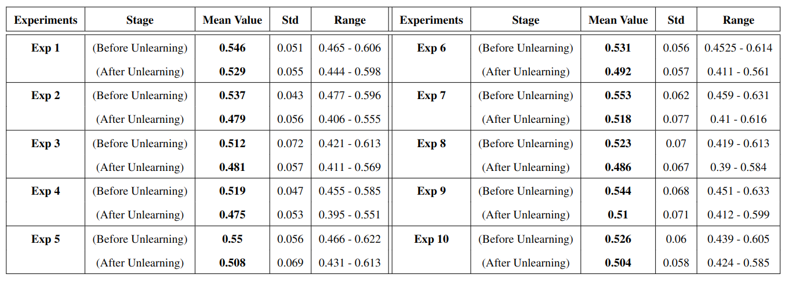

# Unlearning
Here is the code we used to unlearn some of the training samples in order to retrain and see the differences.

All the selected prompts for the Unlearning experiments are in the folder **descriptions**. Each time we unlearn 10 images for each text prompt (150 image-descriptions pairs).

**main_experiment.py:** Make the initial generations and organize the images in folders. Retrieve the most similar images (100 images) based on text.

**raw_image_similarity.py:** Compare raw images and extract metrics.

**compare_embeddings.py:** Extract embeddings from ResNet50 for all the images and extract metrics.

**create_ranking.py:** Combine metrics produced from raw_image_similarity.py and compare_embeddings.py in order to rank the images.

**remove_from_dataset.py:** Remove the images and their descriptions from the dataset according to the ranking.

**regenerate_images.py:** Regenerate after having removed the selected images.

To evaluate the success of the Unlearning we tried to compare the images before and after removing the selected images.

**Experiment 1:** Contains the set of generated images with the retrieved images from dataset, the images from the original model (trained with the full fashion dataset) and the images from the model after removing the "important" images. [Experiment 1](https://drive.google.com/drive/folders/1Ks0hOMLCA2F9UYqad75PlV6UlXmckrpL?usp=drive_link)

**metrics_after_unlearning:** Contains all the csv files with the metrics for each set of experiments.

**compare_after_unlearning.py:** Compare the embeddings of the 2 sets of images (before and after unlearning) so as to extract the metrics.
 
The results (metrics) for the unlearning procedure with some of the images generated are placed in ./metrics_after_unlearning and can be seen in the following table:

 
# Struct of the Code

<body>
    <ul>
        <li>
            &#128193;
            Unlearning
            <ul>
                <li>
                    &#128196;
                    main_experiment.py
                </li>
                <li>
                    &#128196;
                    raw_image_similarity.py
                </li>
                <li>
                    &#128196;
                    compare_embeddings.py
                </li>
                <li>
                    &#128196;
                    create_ranking.py
                </li>
                <li>
                    &#128196;
                    remove_from_dataset.py
                </li>
                <li>
                    &#128196;
                    regenerate_images.py
                </li>
                <li>
                    &#128196;
                    script1.sh
                </li>
                  <li>
                    &#128193;
                    descriptions
                </li>
                <li>
                    &#128193;
                    results
                </li>
                 <li>
                    &#128193;
                    metrics from unlearning
                </li>
                 <li>
                    &#128193;
                    Experiment 1
                </li>
            </ul>
        </li>
    </ul>
</body>

